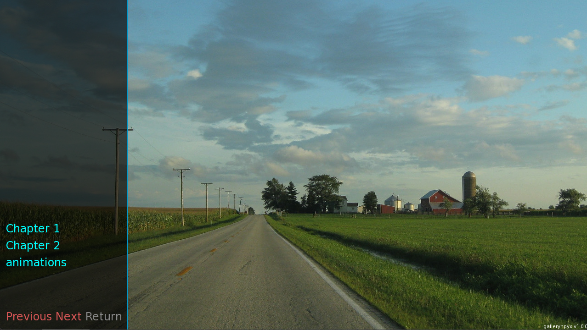

Customizing
===========

gallerynpyx aims to allow flexible customization to adapt the interface and visual style according to your needs and preferences.
With :class:`~gallerynpyx.config.styles.StylesConfig`, you can easily modify aspects such as colors, fonts, sizes and spacing using a set of predefined styles or creating your own custom styles.

In addition, with :class:`~gallerynpyx.config.screens.ScreensConfig`, it is possible to modify the structure of the elements in the different views of the gallery.

With these options, you can create a gallery that suits your personal preferences.

.. _customizing-reference:

Customization reference
-----------------------

.. figure:: customizing/reference.png
    :width: 70em
    :align: center

    Reference of the sections in the gallery by default

Main screen
-----------

The main screen is the default view displayed when accessing the ``gallerynpyx`` screen.
This screen contains some elements that you can customize, such as the background, the foreground and the root screen.

Background
^^^^^^^^^^
The background is the first visual element added to the main screen.
It can be any valid resource: images, solid colors, animations, among others.

Related properties:

* :attr:`~gallerynpyx.config.screens.ScreensConfig.background`

Foreground
^^^^^^^^^^
The foreground is the layer that overlays the background.
It can also contain any valid resource.

Related properties:

* :attr:`~gallerynpyx.config.screens.ScreensConfig.foreground`

Root screen
^^^^^^^^^^^
The root screen acts as the main container of the interface.
It defines the general structure and organizes the other screens or visual elements.

This screen can be customized or replaced.

Screen declaration:

::

    screen gx_root():
        # ...

Related properties:

* :attr:`~gallerynpyx.config.screens.ScreensConfig.root_screen`
* :attr:`~gallerynpyx.config.styles.StylesConfig.root`

Tooltip screen
..............
The tooltip screen displays additional or contextual information about specific items.
It is generally used to display brief explanations, instructions or details when hovering over an item.

This screen can be customized or replaced.

See section 1 in :ref:`customizing-reference` for how and where this screen is displayed by default.

Screen declaration:

::

    screen gx_tooltip(text):
        # ...

Related properties:

* :attr:`~gallerynpyx.config.screens.ScreensConfig.tooltip_screen`
* :attr:`~gallerynpyx.config.styles.StylesConfig.tooltip`

Navigation screen
.................
The navigation screen groups the various controls available for interacting with the gallery.

This screen can be customized or replaced.

See section 2 in :ref:`customizing-reference` for how and where this screen is displayed by default.

Screen declaration:

::

    screen gx_navigation():
        # ...

Related properties:

* :attr:`~gallerynpyx.config.screens.ScreensConfig.navigation_screen`
* :attr:`~gallerynpyx.config.styles.StylesConfig.navigation`

Slides controls screen
""""""""""""""""""""""
The slide controls screen includes the buttons to navigate between the different slides.

This screen can be customized or replaced.

See section 4 in :ref:`customizing-reference` for how and where this screen is displayed by default.

Screen declaration:

::

    screen gx_slide_controls():
        # ...

Related properties:

* :attr:`~gallerynpyx.config.screens.ScreensConfig.slide_controls_screen`
* :attr:`~gallerynpyx.config.styles.StylesConfig.slide_controls`
* :attr:`~gallerynpyx.config.screens.ScreensConfig.show_scrollbar`
* :attr:`~gallerynpyx.config.styles.StylesConfig.scrollbar`

Animations controls screen
""""""""""""""""""""""""""
The animation control screen includes the buttons to modify the speed of the animations.

This screen can be customized or replaced.

See section 4 in :ref:`customizing-reference` for how and where this screen is displayed by default.

Screen declaration:

::

    screen gx_animation_controls():
        # ...

Related properties:

* :attr:`~gallerynpyx.config.screens.ScreensConfig.animation_controls_screen`
* :attr:`~gallerynpyx.config.styles.StylesConfig.animation_controls`
* :attr:`~gallerynpyx.config.resources.ResourcesConfig.allow_animation_speeds`

Controls screen
"""""""""""""""
The controls screen includes the buttons to change pages within the current slide, or to return from the slides or the main gallery.

See section 5 in :ref:`customizing-reference` for how and where this screen is displayed by default.

Screen declaration:

::

    screen gx_controls(has_animations=False):
        # ...

Related properties:

* :attr:`~gallerynpyx.config.screens.ScreensConfig.controls_screen`
* :attr:`~gallerynpyx.config.styles.StylesConfig.controls`

Items screen
............
The items screen is used to display and manage the items within a specific page in a slide.

This screen can be customized or replaced.

See section 3 in :ref:`customizing-reference` for how and where this screen is displayed by default.

Screen declaration:

::

    screen gx_items():
        # ...

Related properties:

* :attr:`~gallerynpyx.config.screens.ScreensConfig.items_screen`
* :attr:`~gallerynpyx.config.styles.StylesConfig.items`

.. warning::
    Note that, depending on the style or screen used as a replacement, some elements may overlap within the root screen.

Images screen
-------------
This screen is responsible for displaying the different items of the gallery.
By default, it is invoked in a new context and overlaps the main screen.

This screen can be replaced.

Screen declaration:

::

    screen gx_images(displayable, item, *args):
        # ...

Related properties:

* :attr:`~gallerynpyx.config.screens.ScreensConfig.images_screen`
* :attr:`~gallerynpyx.config.resources.ResourcesConfig.transition`

.. _customized-gallery:

Customized gallery
------------------

An example of a customized gallery is shown below:

::

    image gx_image = "images/concert1.png"

    image gx_animation:
        "concert1" with Dissolve(.1)
        pause .4
        "concert2" with Dissolve(.1)
        pause .4
        "concert3" with Dissolve(.1)
        pause .4
        "concert2" with Dissolve(.1)
        pause .4
        repeat

    # gallerynpyx styles and screens starts with gx
    style gx_controls_button_text:
        insensitive_color "#d45555"

    style gx_slide_controls_button_text:
        color "#0ff"
        hover_color "#fff"

    # note that some screens receive parameters (check the docs references).
    screen gx_controls_line(has_animations=False):
        $ gx_config = gallerynpyx.config.get_styles()
        hbox:
            style gx_config.controls
            style_prefix gx_config.controls

            textbutton _("Previous"):
                action gallerynpyx.actions.PreviousPage()

            textbutton _("Next"):
                action gallerynpyx.actions.NextPage()

            textbutton _("Return"):
                action gallerynpyx.actions.ReturnSlide(has_animations)

    init python:
        # init handler
        gx_handler = gallerynpyx.get_handler()

        # creating slides
        chapter1 = gallerynpyx.create_slider("ch1", label="Chapter 1")
        gx_handler.root.add(chapter1)

        gx_handler.root.slider("ch2", label="Chapter 2")

        # adding elements
        gx_handler.put(("ch1", "images"), "gx_image", tooltip="Sample")
        gx_handler.put("anim", gallerynpyx.resources.AnimationResource("gx_animation"), thumbnail="concert1", label="animations")
        gx_handler.put(("ch2", "videos"), "oa4_launch.webm", thumbnail="concert1")

        gx_handler.to_first()

        # resources config
        gx_config = gallerynpyx.config.get_resources()
        gx_config.allow_animation_speeds = True

        # screens config
        gx_config = gallerynpyx.config.get_screens()
        gx_config.background = "gui/main_menu.jpg"
        gx_config.foreground = "gui/overlay/main_menu.png"
        gx_config.controls_screen = "gx_controls_line"

And there you have it, an ugly but customized gallery.

    Customized gallery